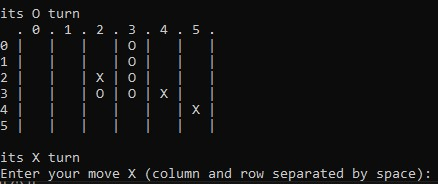

## Πειραματική μελέτη της μεθόδου Τεχνητής Νοημοσύνης Minimax με α–β pruning στο παιχνίδι Reversi

Python 3  (αναπτύχθηκε με Python 3.10.1)
### Εκτέλεση

    python game.py [-s SIZE]

- `-s SIZE`: μέγεθος πλευράς του ταμπλό  
  (προαιρετικό, προεπιλεγμένη τιμή: `8`)

⚠️ Για το προεπιλεγμένο μέγεθος ταμπλό, μετά το βάθος **8** το πρόγραμμα γίνεται αρκετά αργό.

### Παράδειγμα παιχνιδιού με μέγεθος 6

## Minimax

Ο αλγόριθμος αυτός αναζητά τη βέλτιστη κίνηση για έναν παίκτη, υποθέτοντας ότι ο αντίπαλος
θα παίξει επίσης με τον τρόπο που ο αλγόριθμος υπολογίζει ως βέλτιστο για εκείνον.

Η αναζήτηση πραγματοποιείται αναδρομικά, εξετάζοντας όλες τις πιθανές κινήσεις
(εκτός όσων κόβονται από το α–β pruning, αν αυτό εφαρμόζεται),
μέχρι να φτάσει σε τελικό αποτέλεσμα ή στο μέγιστο επιθυμητό βάθος αναζήτησης.

Η αξιολόγηση κάθε κατάστασης γίνεται με βάση την επιλεγμένη ευρετική συνάρτηση.
Ο αλγόριθμος βασίζεται στην παραγωγή νέων στιγμιότυπων (children states)
της κλάσης `Board` και στην αξιολόγησή τους.

### Alpha–Beta Pruning

Το α–β pruning εφαρμόζεται στον Minimax με στόχο τη βελτίωση της χρονικής απόδοσης
του αλγορίθμου, παραλείποντας την εξερεύνηση κλαδιών που δεν επηρεάζουν
την τελική απόφαση.

## Ευρετικές Συναρτήσεις

Υλοποιήθηκαν δύο ευρετικές συναρτήσεις.

### Απλή Ευρετική

Η απλή ευρετική υπολογίζει:
- το συνολικό πλήθος των πιονιών του παίκτη
- μείον το συνολικό πλήθος των πιονιών του αντιπάλου

Σε τελική κατάσταση επιστρέφει:
- `1000` για νίκη
- `-1000` για ήττα
- `0` για ισοπαλία

### Σύνθετη Ευρετική

Η σύνθετη ευρετική ορίζεται ως:

    h(n) = f1(n) + 3 × f2(n) + 2 × f3(n)

όπου:

- **f1(n)**:  
  συνολικό πλήθος των πιονιών του παίκτη  
  μείον το συνολικό πλήθος των πιονιών του αντιπάλου

- **f2(n)**:  
  συνολικό πλήθος των πιονιών του παίκτη που βρίσκονται σε γωνίες  
  μείον το συνολικό πλήθος των αντίπαλων πιονιών που βρίσκονται σε γωνίες

- **f3(n)**:  
  συνολικό πλήθος των πιονιών του παίκτη που βρίσκονται σε μη γωνιακές ακραίες θέσεις  
  μείον το συνολικό πλήθος των αντίπαλων πιονιών που βρίσκονται σε μη γωνιακές ακραίες θέσεις

Σε τελική κατάσταση επιστρέφει:
- `1000` για νίκη
- `-1000` για ήττα
- `0` για ισοπαλία

## Πειραματικά Δεδομένα
### `testing.py`

Με τη βοήθεια της μεθόδου `test`, ο αλγόριθμος **Minimax** ανταγωνίστηκε διαφορετικούς
αλγορίθμους, χρησιμοποιώντας και τις δύο ευρετικές συναρτήσεις.

### Ανταγωνιστικοί Αλγόριθμοι

- **Random**:  
  Επιλέγει μία έγκυρη κίνηση τυχαία.

- **InstaMaxRandom**:  
  Υπολογίζει τις αμέσως επόμενες κινήσεις με τη βέλτιστη αξιολόγηση
  βάσει της ευρετικής συνάρτησης και επιλέγει μία από αυτές τυχαία.

### Ερμηνεία Πινάκων Αποτελεσμάτων

Στους παρακάτω πίνακες:

- **depth**: το βάθος αναζήτησης του Minimax
- **turn**: αν ο Minimax παίζει πρώτος
- **time**: ο μέσος χρόνος ολοκλήρωσης ενός παιχνιδιού
- **games**: ο συνολικός αριθμός παιχνιδιών που πραγματοποιήθηκαν
- **%**: η πιθανότητα θετικού αποτελέσματος για τον αλγόριθμο Minimax

Το ποσοστό `%` υπολογίστηκε ως:

    (wins + ties / 2) / games

### Πειραματικές Αναμετρήσεις

- **Minimax vs Random**
- **Minimax vs InstaMaxRandom**

### Minmax vs Random 
### Simple Heuristic

| Depth | Turn | Wins | Loses | Ties | Games | Time (m/o) | % |
|------:|-----:|-----:|------:|-----:|------:|-----------:|---:|
| 1 | 1 | 334 | 153 | 13 | 500 | 0.1 | 0.681 |
| 1 | 2 | 262 | 218 | 20 | 500 | 0.1 | 0.544 |
| 2 | 1 | 189 | 54  | 7  | 250 | 0.3 | 0.770 |
| 2 | 2 | 175 | 68  | 7  | 250 | 0.4 | 0.714 |
| 3 | 1 | 43  | 7   | 0  | 50  | 1.1 | 0.860 |
| 3 | 2 | 43  | 5   | 2  | 50  | 1.6 | 0.880 |
| 4 | 1 | 21  | 4   | 0  | 25  | 4.8 | 0.840 |
| 4 | 2 | 19  | 5   | 1  | 25  | 5.9 | 0.780 |
| 5 | 1 | 5   | 0   | 0  | 5   | 19.9 | 1.000 |
| 5 | 2 | 5   | 0   | 0  | 5   | 24.5 | 1.000 |

### Minmax vs Random 
### Complex Heuristic

| Depth | Turn | Wins | Loses | Ties | Games | Time (m/o) | % |
|------:|-----:|-----:|------:|-----:|------:|-----------:|---:|
| 1 | 1 | 369 | 125 | 6  | 500 | 0.1 | 0.744 |
| 1 | 2 | 335 | 148 | 17 | 500 | 0.1 | 0.687 |
| 2 | 1 | 212 | 35  | 3  | 250 | 0.4 | 0.854 |
| 2 | 2 | 200 | 45  | 5  | 250 | 0.5 | 0.810 |
| 3 | 1 | 45  | 5   | 0  | 50  | 1.5 | 0.900 |
| 3 | 2 | 43  | 5   | 2  | 50  | 2.0 | 0.880 |
| 4 | 1 | 25  | 0   | 0  | 25  | 5.7 | 1.000 |
| 4 | 2 | 23  | 2   | 0  | 25  | 8.8 | 0.920 |
| 5 | 1 | 5   | 0   | 0  | 5   | 35.7 | 1.000 |
| 5 | 2 | 5   | 0   | 0  | 5   | 37.7 | 1.000 |

### InstaMaxRandom 
### Simple Heuristic

| Depth | Turn | Wins | Loses | Ties | Games | Time (m/o) | % |
|------:|-----:|-----:|------:|-----:|------:|-----------:|---:|
| 1 | 1 | 284 | 198 | 18 | 500 | 0.1 | 0.586 |
| 1 | 2 | 204 | 284 | 12 | 500 | 0.1 | 0.420 |
| 2 | 1 | 182 | 65  | 3  | 250 | 0.5 | 0.734 |
| 2 | 2 | 174 | 72  | 4  | 250 | 0.5 | 0.704 |
| 3 | 1 | 35  | 12  | 3  | 50  | 1.9 | 0.730 |
| 3 | 2 | 39  | 11  | 0  | 50  | 2.1 | 0.780 |
| 4 | 1 | 21  | 4   | 0  | 25  | 6.8 | 0.840 |
| 4 | 2 | 21  | 3   | 1  | 25  | 6.0 | 0.860 |
| 5 | 1 | 4   | 1   | 0  | 5   | 25.2 | 0.800 |
| 5 | 2 | 5   | 0   | 0  | 5   | 34.8 | 1.000 |

### InstaMaxRandom 
### Complex Heuristic

| Depth | Turn | Wins | Loses | Ties | Games | Time (m/o) | % |
|------:|-----:|-----:|------:|-----:|------:|-----------:|---:|
| 1 | 1 | 170 | 316 | 14 | 500 | 0.2 | 0.354 |
| 1 | 2 | 298 | 190 | 12 | 500 | 0.2 | 0.608 |
| 2 | 1 | 194 | 53  | 3  | 250 | 0.5 | 0.782 |
| 2 | 2 | 199 | 43  | 8  | 250 | 0.6 | 0.812 |
| 3 | 1 | 49  | 0   | 1  | 50  | 2.1 | 0.990 |
| 3 | 2 | 43  | 7   | 0  | 50  | 2.6 | 0.860 |
| 4 | 1 | 25  | 0   | 0  | 25  | 6.7 | 1.000 |
| 4 | 2 | 25  | 0   | 0  | 25  | 9.6 | 1.000 |
| 5 | 1 | 5   | 5   | 0  | 5   | 30.9 | 1.000 |
| 5 | 2 | 5   | 5   | 0  | 5   | 56.6 | 1.000 |

## Συμπεράσματα
- Ο αλγόριθμος **Minimax** είναι σαφώς προτιμότερος από την τυχαία επιλογή κινήσεων.
- Ο **Minimax** είναι προτιμότερος από την επιλογή της άμεσα «καλύτερης» κίνησης
  (τουλάχιστον με βάση τις δύο ευρετικές συναρτήσεις που υλοποιήθηκαν).
- Ο **Minimax** είναι καλύτερος από έναν αρχάριο παίκτη (εμένα).
- Η απόδοση του **Minimax** βελτιώνεται όσο αυξάνεται το βάθος αναζήτησης, αλλά αυξάνεται
σημαντικά και ο χρόνος που χρειάζεται για να επιλέξει μια κίνηση.
- Η **σύνθετη ευρετική** είναι καλύτερη από την απλή ευρετική.
- Όλα τα συμπεράσματα ήταν αναμενόμενα και επιβεβαιώνουν τη θεωρία.